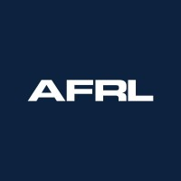
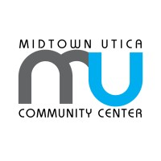
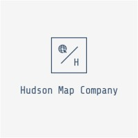
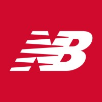
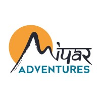
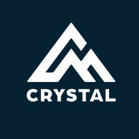
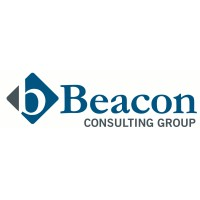
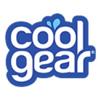
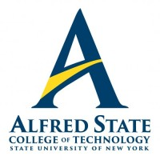

:::: {.cv-page}

Clinton, New York · <a href="mailto:Jacob.Willson13@gmail.com">Jacob.Willson13@gmail.com</a> · <a href="https://github.com/JacobWillson13">GitHub</a> · <a href="https://www.linkedin.com/in/jacob-j-willson/">LinkedIn</a>

## Professional Summary

Data and analytics professional with over a decade of experience in business intelligence, financial reporting, and process improvement. Builds SQL and dbt data models and Python workflows that replace manual processes and reconcile data across systems. Currently an AI research fellow building data pipelines, on-premises GPU inference infrastructure, and evaluation frameworks for machine learning and large language models. Works closely with business stakeholders and leadership to understand complex processes and help teams adopt new tools. Completing an M.S. in Data Science. The work connects two sides of the same problem: making data legible to the people who act on it and building reliable systems that produce it.

## Technical Skills

**Programming and data manipulation:** SQL, Python (pandas, NumPy, SciPy, PySpark, scikit-learn, Pydantic, matplotlib), R (tidyverse), Bash.

**Machine learning and statistics:** scikit-learn, PyTorch, sentence-transformers, HDBSCAN, UMAP, NetworkX; regression, ANOVA, factorial experimental design, statistical inference, sampling design, clustering and community detection, classification, ensemble methods, and deep learning.

**LLM and retrieval systems:** Ollama, vLLM, LangChain, LangGraph, ChromaDB, Qdrant, BM25 and hybrid retrieval, retrieval-augmented generation, LLM-based extraction and scoring, prompt versioning, and evaluation-harness design.

**Data engineering and analytics engineering:** dbt, Snowflake, Databricks, SQL views and reporting tables, PostgreSQL, DuckDB, SQLite, Qdrant, Hightouch, MLflow, idempotent batch pipelines, JSON Schema and Pydantic validation, and PDF parsing (PyMuPDF, pdfplumber, pdfminer).

**Business intelligence and visualization:** Power BI, Tableau, TIBCO Spotfire, Streamlit, LookML, Excel and Excel macros, matplotlib, seaborn, and Quarto.

**Development tools:** Git, GitHub, GitHub Actions, pytest, Jupyter, VS Code, DBeaver, Cursor, and Claude Code.

**Infrastructure and cloud:** Google Cloud (Compute Engine VMs, Cloud Storage, Vertex AI, Model Garden, Document AI, RAG Engine, Gemini, gcloud CLI, ADC authentication, GPU instances), Azure Database for PostgreSQL, NVIDIA CUDA and GPU computing, NVIDIA DGX Spark, Docker and Docker Compose, Linux servers (Ubuntu), Proxmox VE, Prometheus, Grafana, and Tailscale/MagicDNS.

**Enterprise systems:** SAP, Flex PLM, Salesforce, SharePoint, OpenText Invoice Management, Shopify, HubSpot, and EDI and POS systems.

## Professional Experience

::::: {.cv-entry}
:::: {.cv-entry-logos}

::::
:::: {.cv-entry-content}
### Griffiss Institute / Air Force Research Laboratory

**AI Research Fellow** · May 2026–Present

- Built a reusable Python pipeline to acquire roughly 5,000 research papers from OpenAlex and Semantic Scholar, parse them, and extract structured evidence with LLMs, supporting literature-review automation and institutional trust research.
- Benchmarked Python PDF-parsing libraries against LLM-based extraction on accuracy, segmentation quality, hallucination rate, and cost; the results set the pipeline's defaults.
- Built reproducible ML and LLM evaluation workflows on SQLite, DuckDB, and PostgreSQL, with Qdrant for vector search, Pydantic schema validation, and resumable batch processing across multi-million-row experiment datasets.
- Configured a two-node NVIDIA DGX Spark cluster for on-premises edge AI inference, benchmarking tensor- and pipeline-parallel vLLM serving of open-weight LLMs across concurrency levels to identify the highest-throughput configurations.
- Set up a standardized development environment on DGX Spark hardware for incoming interns and contractors, automating the provisioning of Open WebUI, Tailscale, VS Code, and coding agents to mirror on-premises servers.
- Designed and analyzed experiments in Python and R, tracking configurations in MLflow and scoring clustering quality, stability, and agreement against reference categories.
- Applied natural language processing, embeddings, clustering, and network analysis to evaluate and refine a computational taxonomy of psychological influence and propaganda techniques affecting institutional trust.
- Developed an agentic-development methodology for the team, defining project intake, agent roles, workflow decision trees, LLM skill files, and quality gates.
::::
:::::

::::: {.cv-entry}
:::: {.cv-entry-logos}

::::
:::: {.cv-entry-content}
### Midtown Utica Community Center · Utica, New York

**AI Deployment Consultant (Volunteer)** · April 2026–Present

- Ran needs-assessment sessions with nonprofit leadership to identify where AI could remove repetitive administrative work.
- Deployed Gemini across Gmail, Calendar, and Drive and multi-user Claude access; trained the full five-person staff and wrote guidelines for handling client information with AI tools.
- Set up Claude for grant writing and organizational project work, and Gemini for daily scheduling, email, and document tasks.
::::
:::::

::::: {.cv-entry}
:::: {.cv-entry-logos}

::::
:::: {.cv-entry-content}
### SUNY Polytechnic Institute · AIX Research Group

**AI Research Assistant** · September 2025–May 2026

- Benchmarked RAG configurations with a research team, comparing retrieval strategies, embedding models, and language models.
- Developed a RAG chatbot in collaboration with a partner university in Nigeria, evaluating local language and embedding models for operation on an 8 GB GPU.
- Evaluated seven approaches to generating synthetic UAV telemetry using statistical fidelity measures and train-synthetic/test-real testing to assess downstream model performance.
- Built and maintained the Google Cloud AI/ML environments supporting both research teams, including GPU workloads across Vertex AI, Model Garden, Document AI, and Gemini.
- Supported faculty and graduate researchers with environment onboarding, ADC authentication, and runtime troubleshooting, and documented repeatable setup procedures.
- Developed a Google AI and Google Cloud guide for graduate researchers covering Gemini, Colab AI, and credit usage; used by more than 30 researchers and interns, it became the source document for the [Internet Menace academic track](https://www.internetmenace.com/academic), a nine-unit curriculum built with SUNY Polytechnic Institute students.
::::
:::::

::::: {.cv-entry}
:::: {.cv-entry-logos}

::::
:::: {.cv-entry-content}
### Hudson Map Company

**Founding Operations Manager** · May 2025–April 2026

- Co-developed prototypes for an agentic AI freight broker, using LangChain and LangGraph to extract and standardize load details from emails, generate quotes, and match carriers through Gmail and Highway APIs.
- Helped build out freight brokerage operations, including carrier onboarding, digital booking workflows, and daily logistics coordination.
- Implemented Highway alongside FMCSA data and monitoring tools to verify carrier identity and reduce exposure to freight fraud.
::::
:::::

::::: {.cv-entry}
:::: {.cv-entry-logos}

::::
:::: {.cv-entry-content}
### New Balance Footwear

**Business Analyst, Sourced Manufacturing (Remote)** · June 2022–March 2025

- Led the mold and tooling workstream of a manufacturing data transformation, standardizing thousands of spreadsheets with Excel macros and consolidating data with Python and SQL for centralized reporting.
- Migrated tooling initialization, tracking, and amortization records into SharePoint, Power BI, and Flex PLM, replacing spreadsheet-based processes.
- Managed a multiyear amortization reconciliation across more than ten factories in China, Indonesia, and Vietnam, reviewing roughly a decade of records and recovering $5.5 million in credit notes for overpayments.
- Coordinated the reconciliation with U.S. and U.K. business teams, pulling supporting financial data from SAP.
- Analyzed 500–1,000 footwear style-color combinations daily and built Power BI and Spotfire reporting for roughly 200 stakeholders, presenting category-level financial exposure and resolution options.
- Developed demand estimates with product and project managers to guide tooling investment and factory capacity decisions.
- Served as the business subject-matter expert during Flex PLM onboarding and then used the system as a primary user.
- Worked with the Snowflake implementation team to bring current and archived PLM data onto one platform, feeding Power BI dashboards and Power Automate workflows.
::::
:::::

::::: {.cv-entry}
:::: {.cv-entry-logos}
JW
::::
:::: {.cv-entry-content}
### Independent Consulting · JWillson LLC

**Analytics, E-commerce, and Market Research** · June 2018–September 2022

- Built Shopify sites for small businesses, configuring inventory and order workflows and supporting reporting and order management.
- Conducted market research and product-strategy interviews with professional skiers, snowboarders, and climbers for Evolv Climbing, informing product-line organization, positioning, and marketing.
- Partnered with the founder of Montana Overlanding on expansion planning, acquiring three off-road and camping-equipped vehicles and renting them through the company.
::::
:::::

::::: {.cv-entry}
:::: {.cv-entry-logos .logo-stack}

::::
:::: {.cv-entry-content}
### Miyar Adventures / Crystal Mountain Resort

**Professional Alpine Guide, Instructor, and Retail Operations** · November 2016–April 2022

- Guided multi-day mountaineering trips and taught glacier travel and rescue on Mount Rainier and Mount Baker, running 10 to 15 guided trips per season.
- Led Denali preparation and crevasse rescue clinics teaching technical skills for expedition climbing.
- Served as team lead on a Denali expedition with Explore Inspired, through a sponsorship that funded several trips in exchange for my writing, photography, and subject-matter expertise on Rainier and Denali.
- Worked in Miyar's outdoor retail shop, collaborating with the store manager on retail layout, assembling equipment kits for guided-trip clients, and advising clients on gear selection with pre-trip equipment checks.
- Managed daily retail operations and employee scheduling for Crystal Mountain's ski and snowboard demo shop during three winter seasons, and instructed ski and snowboard lessons and guided backcountry ski and snowshoe tours.
::::
:::::

::::: {.cv-entry}
:::: {.cv-entry-logos}

::::
:::: {.cv-entry-content}
### Forrester Research

**Business Intelligence Analyst** · August 2015–November 2016

- Defined cross-functional KPIs and added Salesforce fields to distinguish products bundled into commercial accounts, improving revenue attribution and reporting on account growth.
- Analyzed performance across business units, turning Salesforce data into reporting for business stakeholders.
- Implemented Tableau and automated recurring reporting on bookings, revenue, capacity, and product cycle time to support planning decisions.
- Presented monthly operational and financial performance to the CEO and executive leadership team.
::::
:::::

::::: {.cv-entry}
:::: {.cv-entry-logos .logo-stack}

::::
:::: {.cv-entry-content}
### Northeastern University Graduate Co-ops

**Business Analysis and Process Improvement** · December 2013–July 2015

- **Boston Scientific, Process Improvement Analyst II:** Planned and estimated the global rollout of an OpenText Invoice Management System across 41 countries. Tracked project status, issues, and timelines across international operations, with supporting work in SAP.
- **Reebok International, Graduate Finance and Sales Operations Intern:** Supported the U.S. finance and sales-operations team with reporting and analysis in SAP. Collected, manipulated, and uploaded point-of-sale data; tracked debits and credits for cost-center accuracy; and built expense schedules for operating-expenditure planning.
- **Beacon Consulting Group (now part of Accenture), Intern Associate:** Developed process maps identifying weaknesses in client FP&A and trade-processing operations and supported client deliverables and business development.
::::
:::::

::::: {.cv-entry}
:::: {.cv-entry-logos}

::::
:::: {.cv-entry-content}
### Cool Gear International · Plymouth, Massachusetts

**Business Analyst** · December 2011–July 2013

- Analyzed market, sales, and POS data across domestic and international accounts, producing forecasting and inventory analysis for seasonal product programs.
- Identified product design trends to inform upcoming seasonal programs.
- Built and maintained recurring account-level sales reporting.
::::
:::::

## Selected Projects and Research

### Analytics Engineering and Financial Data

**[Seats-to-Cash: SaaS Finance Data Stack](https://github.com/JacobWillson13/seats-to-cash).** A dbt and Snowflake finance stack on synthetic Orb, Stripe, and Salesforce data that separates ARR expansion from repricing, reconciles billings, revenue, deferred revenue, and cash, and syncs account signals to Salesforce via Hightouch. Every MRR and revenue figure matches a generated answer key to the cent, six planted data defects are handled in staging, and month-end closes are immutable, with late-arriving rows surfaced as traced restatements.

### LLM Evaluation and Benchmarking

**[Gemma 4 Context Utilization for Security Advisories](https://github.com/JacobWillson13/gemma4-eval).** A balanced factorial experiment evaluating how model size, supplied evidence, reasoning condition, and temperature affect security-advisory performance across 3,900 local inference runs. Question-blocked analysis showed that supplied context improved valid-response accuracy most strongly on hard questions and for the smallest model.

**[CiteBench: Citation Extraction Workflow Benchmark](https://github.com/JacobWillson13/citebench).** A reproducible benchmark comparing 11 citation-extraction workflows across PDF, text, vision, targeted-context, hybrid, and specialist-parser approaches. The repository contains 705 recorded results under a shared schema and scoring framework, versioned prompts, representative evidence chains, and automated validation.

### Retrieval Systems

**[DOME Handbook RAG](https://github.com/JacobWillson13/dome-rag).** A local retrieval-augmented generation system and evaluation suite for question answering over a complex engineering handbook. Across 6,672 question-level records, the experiments compare retrieval strategies, embeddings, and language models while testing relevance checks, abstention, and source attribution.

### Ontology and Text Analysis

**[SCIO: Socio-Cognitive Influence Ontology Validation](https://github.com/JacobWillson13/scio-eval).** Evidence-driven validation of an influence-technique ontology using literature analysis, LLM-assisted coding, embeddings, clustering, network analysis, and structured human review. Cluster solutions are assessed against reference groupings and stability measures rather than accepted through visual inspection alone.

### Applied Analytics and Modeling

**[Freight Cost and Sampling Analysis](https://github.com/JacobWillson13/freight-cost-analysis).** An end-to-end analysis of 500,000 synthetic U.S. freight trips combining sampling design, route-level business intelligence, cost-driver analysis, and operational segmentation. Because the population is fully known, sampling and modeling choices can be tested against ground truth while revealing how confounding changes apparent cost relationships.

**[Synthetic UAV Telemetry Generation and Transfer Evaluation](https://github.com/JacobWillson13/uav-pnt).** A comparison of seven synthetic time-series generation approaches across UAV navigation and EuRoC inertial telemetry. Models are evaluated on statistical fidelity and downstream utility using train-synthetic/test-real classification and multistep sequence regression.

### Methodology and Tooling

**[Agentic Development Workflow](https://github.com/JacobWillson13/agentic-dev-workflow).** A human-governed workflow for planning and executing analytics, data-science, and applied-AI projects with coding agents. It defines project intake, agent roles, workflow decision trees, skill files, quality gates, and reproducibility controls so agent-assisted work remains auditable.

### Research and Proposals

**Wasted Momentum: Vehicle-Powered Edge AI.** A research proposal for powering distributed AI inference from surplus vehicle electrical output, developed from a first-place entry in the SUNY Polytechnic Institute research pitch competition. The proposal includes a pitch deck, companion white paper, and literature review; it remains at the proposal stage, with no pilot measurements claimed.

## Research Computing and Infrastructure

**GPU and local inference:** NVIDIA GPU and CUDA environments running Ollama and vLLM for model serving, spanning quantized inference on consumer hardware and A100 instances for training and generation workloads. Multi-node inference on NVIDIA DGX Spark with tensor- and pipeline-parallel vLLM serving.

**Cloud:** Google Cloud Compute Engine, Cloud Storage, Vertex AI, Model Garden, Document AI, RAG Engine, and ADC authentication, including GPU-instance provisioning and documented setup procedures for new researchers.

**Containers and orchestration:** Multi-container Docker Compose environments for reproducible research stacks, with Proxmox VE virtualization for workload isolation.

**Monitoring and remote access:** Prometheus, Grafana, and cAdvisor for resource and system-health monitoring. Tailscale, Syncthing, and VS Code Remote SSH for development across machines, with documented provisioning for NVIDIA and CUDA, Docker Compose, Ollama, vLLM, Python with uv, and R with tidyverse.

**Reproducibility:** MLflow experiment tracking, versioned prompts and configurations, idempotent batch execution for long-running jobs, schema validation on machine-generated output, and automated repository validation that runs without external API calls.

## Education

::::: {.cv-entry}
:::: {.cv-entry-logos}

::::
:::: {.cv-entry-content}
### SUNY Polytechnic Institute · Utica, New York

**Master of Science in Data Science and Analytics** · Expected May 2027  
Focus: Computer Science and Artificial Intelligence

**Selected graduate coursework:** Statistical Inference; Regression and Analysis of Variance; Data Collection and Design of Experiments; Introduction to Machine Learning; Artificial Intelligence; Big Data Platforms and Analytics; Database Systems.
::::
:::::

::::: {.cv-entry}
:::: {.cv-entry-logos}

::::
:::: {.cv-entry-content}
### Northeastern University · Boston, Massachusetts

**Master of Science in Management** · April 2015  
Focus: Project Management and Economics
::::
:::::

::::: {.cv-entry}
:::: {.cv-entry-logos}

::::
:::: {.cv-entry-content}
### Alfred State College · Alfred, New York

**Bachelor of Business Administration** · May 2012  
Focus: Technology Management
::::
:::::

## Awards

**First Place, Elevator Pitch Competition** · SUNY Polytechnic Institute, 2025  
Awarded for “Wasted Momentum: Vehicle-Powered Edge AI.”

## Certifications

**Technical**

- Databricks Fundamentals
- Databricks Certified Data Engineer Associate (in progress)
- Microsoft Certified: Power BI Data Analyst Associate
- AI Infrastructure and Operations — NVIDIA
- Machine Learning Specialization — DeepLearning.AI and Stanford Online
- Machine Learning Engineer — Google Cloud (in progress)

**Professional**

- Certified Associate in Project Management (CAPM) — Project Management Institute
- Controlled Unclassified Information (CUI) Training — U.S. Department of Defense

::::
